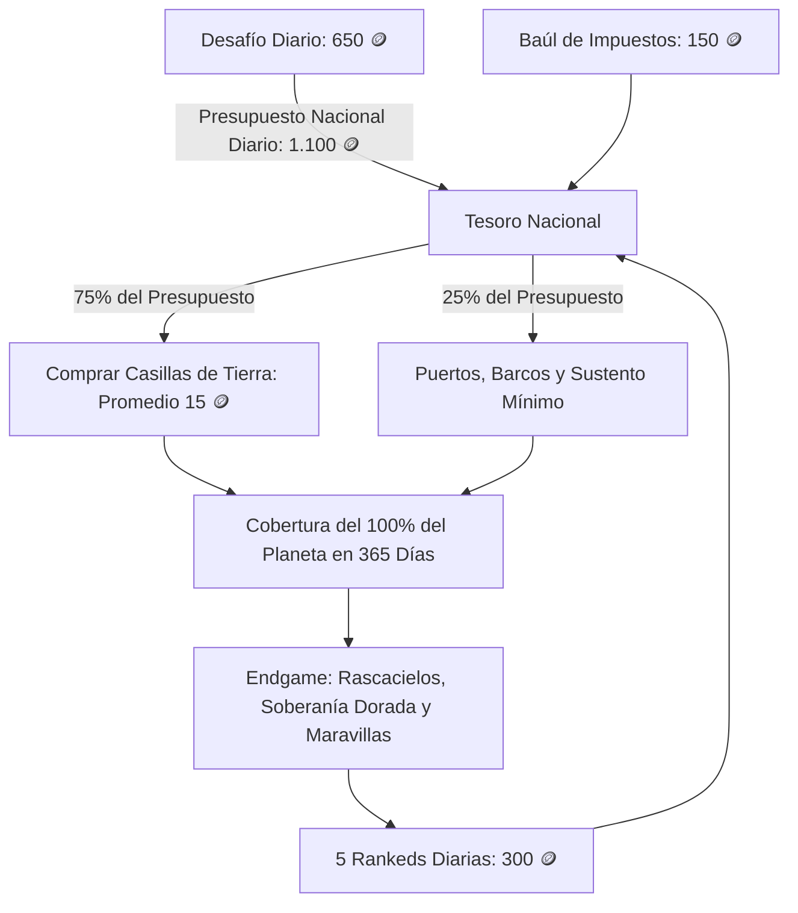

# 📜 GAME DESIGN DOCUMENT (GDD)
# Proyecto: GeoStrike — Modo Secundario: "Imperios"
**Document Version:** 1.5.0  
**Lead Game Designer:** Antigravity  
**Estado:** Pendiente de Aprobación de Dirección  

---

## 1. Visión General y Pilares del Juego (High Concept)

### 1.1. Resumen Ejecutivo
**GeoStrike: Imperios** es un modo secundario incremental (idle / puzzle espacial / gestión geopolítica minimalista) integrado dentro de GeoStrike. Los jugadores fundan su propia civilización soberana en cualquier rincón del planeta, expandiéndose **cuadradito a cuadradito** por tierra en un **tablero táctico 2D**, gestionando el equilibrio espacial de sus núcleos urbanos con una mecánica inspirada en el **Buscaminas**, y fletando expediciones marítimas estratégicas para colonizar archipiélagos y continentes lejanos.

Como elemento visual destacado, incluye un **Modo Globo 3D (Three.js)** interactivo para admirar tu imperio proyectado sobre la curvatura de la Tierra, rotar el planeta y presumir de territorio en los perfiles.

El modo no compite con el juego principal: actúa como el **motor de retención y tracción número 1** de GeoStrike. Para expandirte y construir, necesitas el combustible del juego principal: **completar el Desafío Diario** y **competir en Rankeds 1v1**.

### 1.2. Pilares de Diseño
1. **Puro Vicio y Coleccionismo (Sin Game Over)**: Sandbox infinito sin fin de partida. El placer reside en colorear el globo, ver crecer tu población y conseguir logros geográficos frikis.
2. **Puzzle Espacial Limpio en 2D (Estilo Buscaminas)**: Sin menús engorrosos de microgestión. Las ciudades evolucionan comprobando físicamente qué casillas de recursos tienen alrededor en su radio de influencia.
3. **Visor Espectacular: Globo 3D vs. Táctico 2D**: El juego táctico se realiza en el mapa 2D plano (máxima comodidad y precisión táctil), pero con un clic pasas al Globo 3D para ver tu civilización en una esfera realista con Three.js.
4. **La Meta Anual (365 Días)**: Economía matemáticamente calibrada para que un jugador casual diario (Diario + 5 Rankeds) conquiste el 100% de las casillas de la Tierra en **exactamente 1 año natural** con infraestructura mínima.
5. **El "Endgame" de Soberanía**: Conquistar la tierra solo te da la posesión física; a partir del Día 366 comienza el reto de densificar población y reclamar la Soberanía Dorada y las Maravillas de cada uno de los 195 países.

---

## 2. El Bucle de Retención y Economía Calibrada (365 Días)

### 2.1. Las 3 Fuentes de Financiación (1.100 🪙 / día)

#### A. El Desafío Diario (El Gran Presupuesto Nacional)
* Recompensa promedio con multiplicador de racha activa: **650 🪙 / día** ($\approx 237.250$ monedas al año).

#### B. Las Rankeds 1v1 (El Farmeo de 5 Duelos Diarios)
* **Duelos 1 a 5 del día** (El cupo óptimo):  
  * Victoria: $+75$ monedas | Derrota: $+25$ monedas | Racha: $+50$ monedas.
  * Promedio diario en 5 partidas: **300 🪙 / día** ($\approx 109.500$ monedas al año).
* **Duelos 6 a 15** (Soft Cap / Rendimiento moderado): $+20$ monedas por victoria.
* **Duelo 16 en adelante** (Grinder): $+5$ monedas fijas por victoria.
* Reclamación mediante el **Buzón de Botín de Guerra** (`[ 💰 RECLAMAR TODO ]`).

#### C. El Baúl de Impuestos (Fórmula Amortiguada)
* Con la infraestructura mínima de supervivencia y campamentos básicos: **150 🪙 / día** ($\approx 54.750$ monedas al año).
* **Condición de apertura**: Jugar las **5 partidas Rankeds diarias**.

$$\text{Presupuesto Total Anual} = (650 + 300 + 150) \times 365 = \mathbf{401.500 \text{ Monedas}}$$

---

## 3. Desglose del Planeta y Costes Unitarios 🪙

### 3.1. Dimensiones del Tablero Mundial
* La Tierra se compone de **$\approx 20.000$ casillas de tierra** transitables y colonizables.
* **España**: $\approx 300$ casillas.
* **Europa**: $\approx 2.500$ casillas.
* **Todo el Planeta**: $\approx 20.000$ casillas.

### 3.2. Tabla de Costes de Casillas de Tierra (Escalado Suave)
* **Casillas 1 a 1.000** (Primeras semanas): **5 a 8 🪙** (Avance rápido, gancho de retención).
* **Casillas 1.000 a 5.000** (Mes 1 a 3): **10 a 14 🪙**.
* **Casillas 5.000 a 15.000** (Mes 4 a 9): **16 a 18 🪙**.
* **Casillas 15.000 a 20.000** (Mes 10 a 12): **20 a 22 🪙**.
* **Coste Promedio por Casilla**: **15 🪙**.
* $$\text{Gasto Total en Tierra} = 20.000 \times 15 = \mathbf{300.000 \text{ 🪙}} \quad (75\% \text{ del presupuesto anual})$$

### 3.3. Tabla de Infraestructura Mínima de Salto (100.000 🪙)
* ⚓ **Puerto Básico**: **100 🪙** (120 puertos en el mundo = $12.000$ 🪙).
* ⛵ **Fletar Barco**: **50 🪙** (400 viajes marítimos necesarios = $20.000$ 🪙).
* 🚢 **Megapuerto Transoceánico**: **300 🪙** (5 megapuertos intercontinentales = $1.500$ 🪙).
* 🌾 **Huertos y Canteras Básicas**: **25 🪙** (1.400 puntos de comida/piedra = $35.000$ 🪙).
* ⛺ **Campamentos y Chozas de Salto**: **5 a 10 🪙** (Almacén de colonos = $15.000$ 🪙).
* 🔄 **Reconversiones y Contingencia**: $16.500$ 🪙.
* $$\text{Total Infraestructura Mínima} = \mathbf{100.000 \text{ 🪙}} \quad (25\% \text{ del presupuesto anual})$$

---

## 4. Cronograma de Conquista Física (Día 1 a 365)

| Hito Temporal | Territorio Acumulado | Alcance Geográfico | Estado Imperial |
| :--- | :--- | :--- | :--- |
| **Día 1** | 10 casillas | Andorra completa + inicio de España | 1 Aldea con tiendas de campaña |
| **Mes 1 (Día 30)** | 500 casillas | España completa + salto a Baleares y Marruecos | Primeros barcos costeros y 3 pueblos |
| **Mes 3 (Día 90)** | 2.500 casillas | Europa Occidental y Cuenca Mediterránea | Red de puertos y colonias básicas |
| **Mes 6 (Día 180)** | 8.000 casillas | Toda Eurasia y África | Rutas terrestres ininterrumpidas |
| **Mes 9 (Día 270)** | 14.000 casillas | América del Norte y del Sur colonizadas | Rutas transatlánticas activas |
| **Día 365 (1 AÑO)** | **20.000 casillas (100%)** | **¡TODO EL PLANETA TIERRA PINTADO DE TU COLOR!** | **Conquista de Facto con Infraestructura Mínima** |

---

## 5. El "Endgame" (Día 366 en Adelante): Soberanía Real y Maravillas

Al llegar al día 365, el jugador tiene todo el mundo pintado, pero sus países están en "mínimos" (campamentos, tiendas y huertos básicos). **Ningún país grande ha sido asimilado de iure**.

A partir de este momento comienza la segunda vida del juego:
1. **Densificación Urbana**: Evolucionar asentamientos a Ciudades y Megaciudades con Rascacielos (100 🪙) y Centrales Eléctricas (80 🪙).
2. **Censo Local y Reclamación de Países**:
   * **🥉 Rango 1 (Conquistado de Iure - 5% población real)**: Medalla y bandera oficial.
   * **🥈 Rango 2 (País Desarrollado - 50% población real)**: Construcción de la **Maravilla Nacional** (*Sagrada Familia*, *Torre Eiffel*, *Taj Mahal*, *Gran Muralla*) con perks permanentes.
   * **🥇 Rango 3 (Soberanía Dorada - 100% población real)**: Pintura de oro metálico en el mapa 2D y Globo 3D, marco de avatar exclusivo y título de emperador.
3. **Árbol de Leyes Imperiales**: Desbloqueo de leyes legendarias al alcanzar 10M, 50M y 100M de habitantes en el censo global.

---

## 6. Arquitectura Técnica y Visores (2D Canvas + Globo 3D Three.js)

* 🗺️ **Modo Táctico 2D (HTML5 Canvas)**: Compra ágil de casillas, visualización Buscaminas por radios ($\le 1, \le 2, \le 3$), reconversión de casillas y gestión de slots de edificios sin distorsión.
* 🌐 **Modo Globo 3D (Three.js)**: Esfera 3D interactiva para rotar la Tierra, admirar tu mancha expandiéndose con luces, ver los arcos de los barcos navegando y fardar en el perfil de usuario.
* 🏝️ **Islas Pequeñas ($\le 8$ casillas)**: Tope máximo de Pueblo (Nivel 2) y especialización directa desde la primera casilla (Banco Offshore, Resort Turístico o Hub Naval de 3 muelles).

---

## 7. Plan de Implementación por Fases (Roadmap)

1. **Fase 1: Motor de Cuadrícula 2D y Visor Globo 3D**
   - Matriz de 20.000 casillas de tierra con algoritmo de filtrado Tierra/Mar y microislas garantizadas.
   - Canvas 2D con Pan, Zoom y controles táctiles fluidos.
   - Visor esférico 3D en Three.js con rotación orbital y proyección de casillas colonizadas.
2. **Fase 2: Economía Calibrada (1.100 🪙/día) y Buzón de Duelos**
   - Integración de recompensas en Ranked (75 por victoria, soft cap a partir de la 6ª).
   - Componente UI de Buzón con `[ Reclamar Todo ]`.
   - Baúl de Impuestos con candado desbloqueable tras 5 rankeds diarias.
3. **Fase 3: Expansión por Adyacencia, Sistema Buscaminas y Costes Oficiales**
   - Compra escalonada (5 a 22 🪙) y slots de edificios por nivel.
   - Censo local por país y niveles de desarrollo (🥉 de iure, 🥈 Maravilla, 🥇 Soberanía Dorada).
4. **Fase 4: Islas Pequeñas, Puertos y Expediciones con Temporizador**
   - Puertos continentales (1 barco) vs Hub de Isla (3 barcos simultáneos).
   - Animación de navegación con temporizador en segundo plano en 2D y Globo 3D.
5. **Fase 5: Modo Satélite en Perfil y Logros Frikis**
   - Inspección del imperio de otros jugadores (2D y 3D).
   - Vitrina de soberanías y medallas geográficas.
